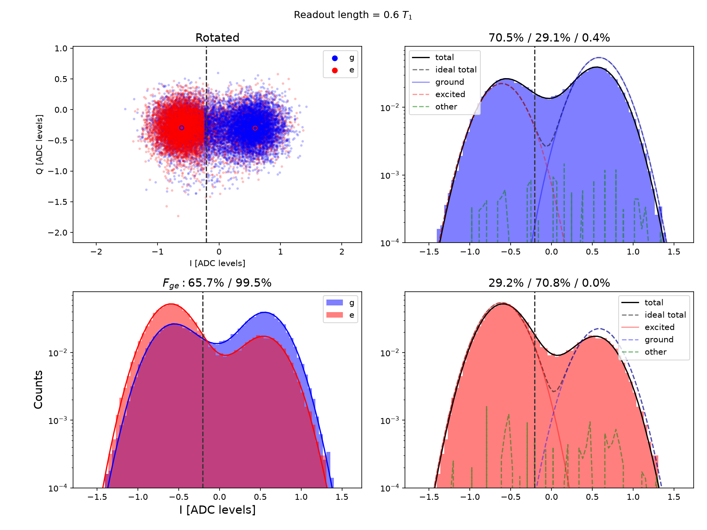
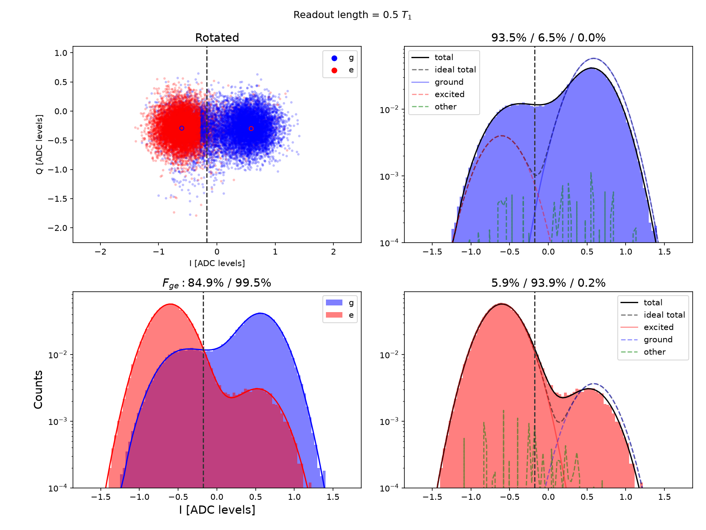
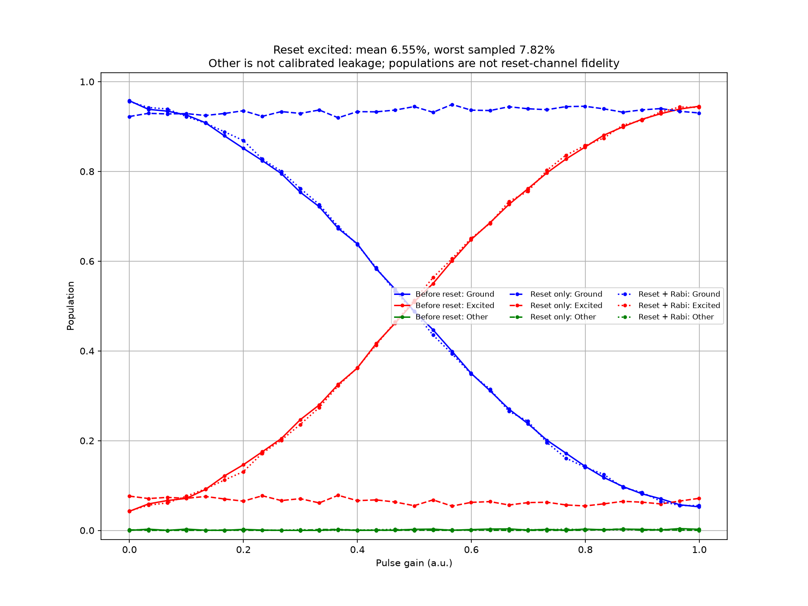
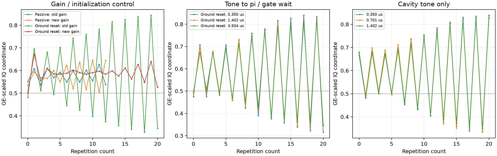

# Q1 half flux cavity reset 案例（2026-10-06）

環境 Q12_2D[10]/Q1、Yoko +7.1804mA、q_f≈309.153MHz、ch14/NQZ1/mixer317.5MHz；readout ch0/NQZ2、5349.921858MHz、gain.06、integration3.323568µs。所有數值是當次案例，不是模板。

## 標籤反例

最初 GE 沿用預設 init_pulse=pi_amp，agent 漏核對而把主要 cluster 誤認物理 ground。後來完整保存 cfg 揭示問題。明確禁用 init 後，passive 500µs、50000shots 的 reference 給出 g_center≈+.541-.369j、e_center≈-.642-.210j，初始 ground model estimate≈70.5%。早期 MIST 圖的 state labels 已在 journal 更正；不採「接近100%ground」的錯誤主張。

圖源 reset_ge_passive_noinit_fit.png；主要物理 G cluster 在正 I，初態有熱混合。Gaussian 分離與 raw assignment 不相等。此圖支持物理標籤及該次模型分布，不證明其他工作點的初始化。

## 順序 reset 與 ringdown

Weak cavity spectrum 的 fit freq=5345.801981MHz、FWHM=14.267910MHz；依使用者 5*2pi/kappa 指示及 κ/2π=FWHM 定義，post_delay=.350436748µs。

tone gain.11、20.01µs、ch0/NQZ2。TwoPulseReset 的第二個 pulse 是固定250ns/gain.946861542的 qubit π；pulse2.pre_delay=20.360436748µs，以實測驗證順序。沒加此 pre_delay 的候選沒有準備物理 G。公開 dual-tone guide 是兩個 tone 同時，不能由名字假定串接。

GE no-init、100000shots、rel20 的10.01µs候選初始G約91.43%；20.01µs約93.54%，raw assignment84.95%。這些是原生模型估計；confusion matrix 包含初態混合及分類效應，不能當成完美 detector calibration 或 reset-channel fidelity。

圖源 reset_ge_ground20_noinit_fit.png；物理 centres 與 passive reference 一致，主 cluster 換到 G。模型比較支持20µs比10µs較純，但沒有證明全域最短或最高純度。

圖源 reset_check_ground20_populations.png；31 gain points、5000shots×2、rel20；reset-only mean Pe=.065536、sampled max=.078182、Other max=.003258。支持不同被掃描初態收斂到 ground-dominant 分布；不等於 process fidelity 或校準 leakage。

## Gate 條件的反例

短等待+reset 的 native gain scans 推出π≈.9692、π2≈.9689，高於先前 passive 的.9469/.9459。独立 zigzag 有前端 transient；有／無 reset 控制顯示新的 gain 無法直接套回 passive。加 qubit reset 後間隔 .5或2.01µs沒有消除差異。此處沒有確診物理或實作原因。

同 root seed、20seed×2round、depth120/31、150reps 的 X90 IRB：兩gain調高時 F≈.987608/p_ref≈.974275；舊gain+reset F≈.990163/p_ref≈.969282。兩個 interval 有重疊，reference 同時改變，不能只用最高 IRB ratio 選 gate 集合。後續混合gain及四gate驗證見 task journal。

## Photon / AC Stark 控制

使用者後續提出「我通常會懷疑是photon沒decay完，造成acstark shift，gate出現detune」。這是待驗證的專家假說。將 cavity-only 的 post_delay 設.350/.701/1.402µs，或 ground reset 的 tone post_delay 與 π pre_delay 同步設.350/1.402/3.504µs，ordinary zigzag 的主要 growing parity 仍存在。固定 GE centre 向量的 n=4..12 描述性 parity slope，ground 三者約-.01375/-.01279/-.01269，未消除。它不證明沒有 photon，也不能保證請求 timing 等於已獨立量到的物理 waveform。

同 cavity-only 条件的28µs Ramsey，在.350與1.402µs得到detune約.499851與.499316MHz、formal freq stderr各約.37kHz，差.535kHz約一個合併sigma。這未確認穩態 detune 差異；full Ramsey 的 free phase 可能吸收快速 transient，不能由此排除脈衝當下的短暫 Stark effect。原始cfg/圖保存於ringdown_* tags，離線方法plot_reset_controls.py與reset_controls.json/png提供來源。

圖源 reset_controls.png；各 trace 用相同 physical GE centre vector 做線性投影，稱 GE-scaled IQ，不是已校準人口。描述性 parity slope 只 fit 共同 n=4..12，不把前端transient刪掉後稱校準通過。圖支持所測等待範圍未消除主要形狀；沒有獨立量到實際 waveform 時序。

π repetition frequency scan 在.350與3.504µs兩條件都呈多個近似low點，後者最佳點還在上界。公開 guide 明確提醒硬體採 absolute-time drive phase。兩個 native min 未作 q_f writeback；不能把 loss minimum 隨意轉成唯一 Stark shift。來源 stark_freq_delay1/10，Q1_zigzag_scan_freq_1006@1006_half_gate_detune_1/_2.hdf5。

## 來源

量測 repo 的 .agent_state/measurement-tasks/20261006-q1-half-gates/，journal.md 記錄修正與判斷，tag JSON 指向保存 raw 及完整 cfg。正式 raw 在 Database/Q12_2D[10]/Q1/2026/10/Data_1006/：

- Q1_sh_ge_1006@1006_half_reset_trial_5.hdf5：passive no-init reference。
- Q1_sh_ge_1006@1006_half_reset_trial_7.hdf5、_8.hdf5：10/20µs delayed π no-init。
- Q1_ss_reset_check_1006@1006_half_reset_trial_2.hdf5：correct-label reset check。
- Q1_irb_1006@1006_half_reset250_1.hdf5、Q1_irb_1006@1006_half_reset250_old_1.hdf5：上述 IRB 比較。

本文及圖片不引用 MCP session 暫存路徑。正式 task 結案後的最佳 gate 條件應另看最終報告，不由本初始化案例取代。
