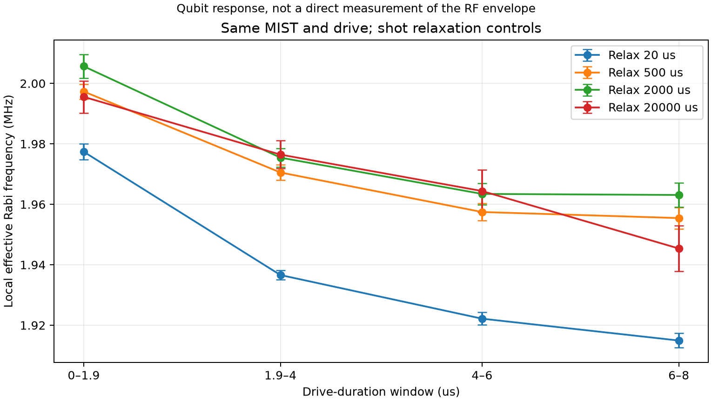
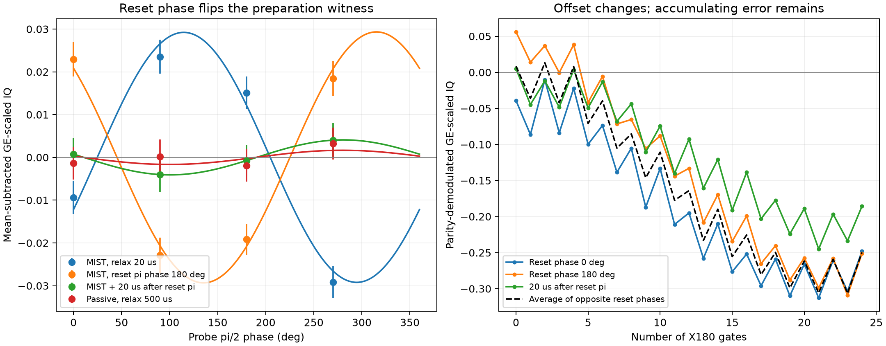
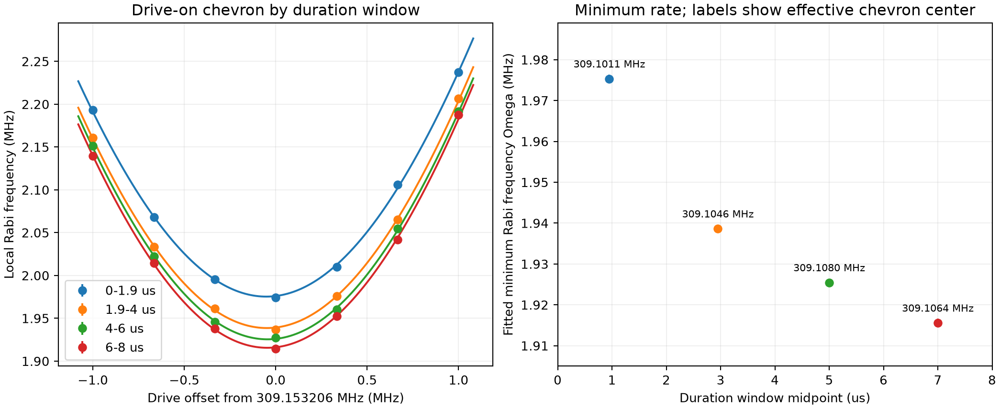
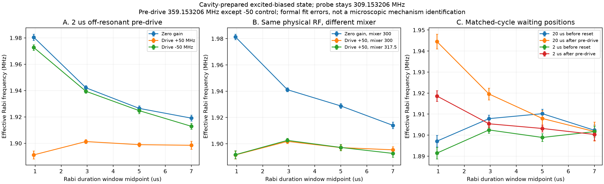
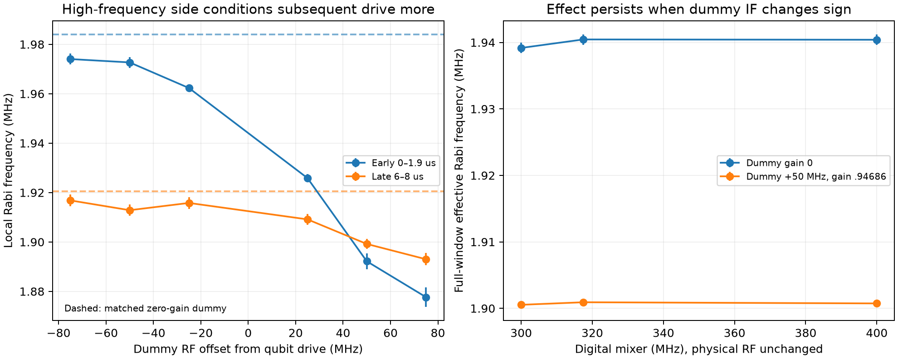
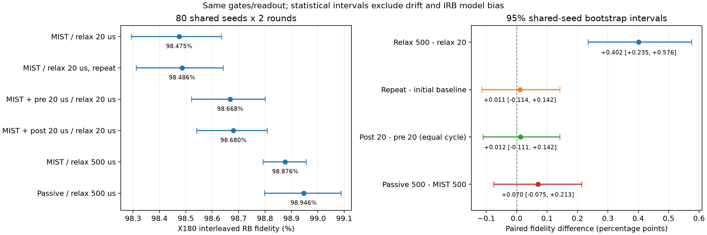
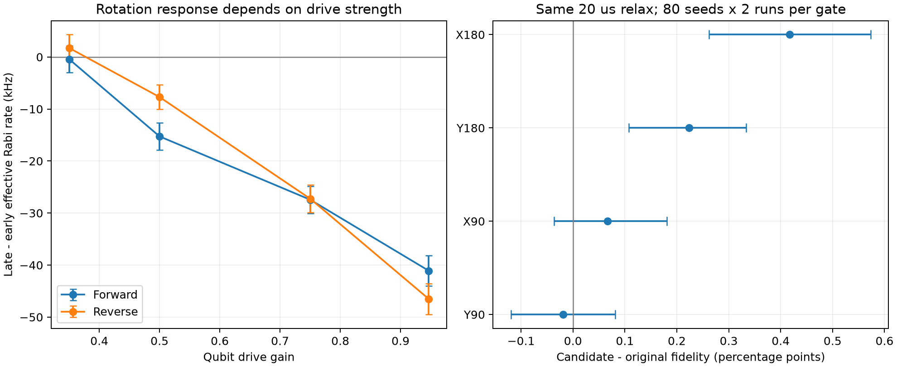
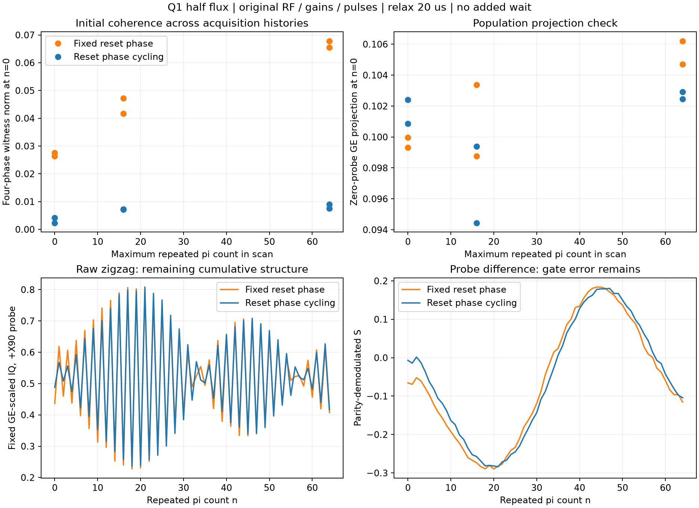

> 2026-10-08收尾：臨時診斷程式已封存並移出正式runtime；phase cycling與通用bug修正保留。完整波序列、重現與封存入口見[四輪整合](../q1-half-investigation-20261007/README.md)。下文是當輪歷史證據。

# Q1 half flux：初始化 coherence 與 drive 歷史分開辨別

2026-10-07，Q12_2D[10]/Q1，flux +7.1804mA；qubit309.15320594MHz、ch14/NQZ1/mixer317.5，readout5349.92185792MHz、gain.02。MIST5345.80198085MHz/gain.11/20.01µs，tone後約.350µs才做250ns resetπ。這些是案例條件，不能直接移植。

## 新證據改變了什麼

前一日的「殘留 photon／快速 Stark」仍是合理待驗證假說。本次確認 ringdown 已進入編譯，且主要累積異常在 cavity tone及resetπ都設gain0時仍存在；MIST專屬殘留photon不是觀察到duration dependence的必要條件。沒有量到qubit線的RF waveform，仍不唯一識別控制鏈或qubit微觀機制。

相同MIST與gate，只改relax20→500µs，短Rabi f由1.97423±.00137→1.99803±.00129MHz，回到20重驗1.97296±.00123。額外480µs移到tone之前亦1.99759±.00150；tone→π→gate未改。GE初始G約95.59%與95.63%，不支持把差異只歸因於初態population。

將X90+nX180換成同總時長continuous const pulse，主要trace重合，限制Repeat接縫解釋。高gain .94686長Rabi在0–1.9／6–8µs局部頻率约1.9774／1.9149MHz；gain .5約1.0824／1.0767。無MIST但保留timing亦有下降。這是有效旋轉響應，不是RF振幅直接測量；內層length scan同時改變近期duty/history。

最後降低重複率至relax20ms（400reps×1、201點），早/晚仍1.99556±.00529／1.94539±.00761MHz，差−50.17±9.26kHz；單靠延長shot等待未消除duration dependence。此為一筆低shots控制，誤差是局部fit formalσ，不含模型／drift，也不能據此指定RF時常數。長等待條件間的微小差異不必單調。

## 初態相位 witness

30k shots、no-init、π2 probe四phase；以固定GE向量投影IQ。MIST20的0−180／90−270差為−.02447±.00539／+.05270±.00540。Passive500接近零；resetπphase180時變成+.04212±.00537／−.04136±.00583；π後等待20µs變成+.00151±.00526／−.00804±.00570。誤差為100shot block SEM，未計跨run漂移。

左圖為扣除各組均值的probe-on IQ，支持reset相關相干分量；包含gate imperfections，不是完整tomography。右圖parity-demodulation顯示phase反轉主要改offset，n4..12 slope約−.01966／−.01915仍相近；post20 slope仍−.01422。相干分量不能單獨解釋累積異常。不同adapter的採集次序／history不同，不用GE witness數值直接預測zigzag n=0。

## Drive-on 與 conditioning 控制

±1MHz共7個RF的長Rabi，早／晚window fit最低Ω=1.97530±.00108／1.91555±.00105MHz；effective center309.10113±.00348／309.10640±.00358MHz。中心差5.27±4.99kHz，主要變化在Ω。曲率與sqrt模型相符，但絕對vertex可能受RF transfer slope偏置。將zigzag seed/repeat改到309.10613MHz並未改善主要parity，未writeback頻率。

图源drive_on_chevron.png，windows來自重建actual pulse axes及無phase邊界fit；formal errors不含模型／時段系統誤差。限制簡單detune主導解釋，不排除所有快速或drive-induced物理。

Cavity後、Rabi前加2µs/+50MHz qubit drive，可將Rabi由約1.980→1.919MHz改為約1.891→1.898MHz，變慢但較平坦；gain0的同timing控制回復。−50MHz較弱，sameRF但mixer300結果保留。同總cycle的pre/post2或20µs等待顯示postwait恢復前段速率較多。**這些conditioning組均無最後ground resetπ，以cavity準備E-biased初態**；不和ground組直接當成同prep比較。

頻率不對稱不支持未加限制的「broadband amplifier compression」斷言；需要直接RF／線路證據才能指認元件。Readout gain .01/.02/.04的長Rabi速率相近，16倍readout功率差未移除duration dependence。

後續dummy offsets −75/−50/−25/+25/+50/+75MHz的全窗口effective Rabi f約1.93708/1.93652/1.93334/1.92066/1.90092/1.89480MHz；高頻側影響較強，並非只有單一+50MHz點。Same physical RF、mixer300/317.5/400MHz的active−zero差為−38.64±.83/−39.53±.84/−39.66±.83kHz。400MHz連dummy IF符號也翻轉，返回317.5仍再現，限制單純IF符號／mixer配置錯誤解釋。Formal誤差不含模型／跨時段系統誤差。

## 目標benchmark與限制

80共同seeds×2rounds、200reps、depth0:4:160、root2026100701，原gate/readout、同MIST：relax20 F98.4747%，500 F98.8764%。共同seed bootstrap3000次得ΔF=+.4018pp、95%CI[+.2351,+.5756]pp；逐round及depth窗口保留方向。改善不只是zigzag代理，但CI不包含序列模型偏差與時段drift。

同日passive500 F98.9462%，相對MIST500差+.0698pp、CI[−.0754,+.2135]，未解析到長等待下MIST的额外penalty。原MIST20重驗98.4855%，相對初測+.0109pp、CI[−.1141,+.1420]，不支持以簡單整體漂移解釋長等待改善。

Reset前／resetπ後各加20µs且relax仍20，F分別98.6679／98.6804%。等總cycle比較post−pre為+.0125pp、CI[−.1109,+.1419]，沒有解析到等待位置的額外IRB收益。Post20雖使phase witness接近零，但不能把IRB改善全歸因於消除coherence；shot cycle/history也是重要混淆。不同實驗／sequence的coherence敏感性不可互相等同。

## 同日短等待硬體重驗（10:44起、4小時上限）

重新啟動GUI載入time/phase diagnostics後，同一108-cycle waveform只改occupied time一tick，4 ABBA blocks之late parity slope差−.0003743、95%block CI[−.0013185,+.0005699]；loop/unrolled差−.0000464、CI[−.0006344,+.0005416]。全部28個相對clock residue正反掃描亦保留主parity。Ch14 .400543Hz DDS grid的同word與相鄰word對照均保留異常。這些實驗限制普通量化／執行路徑為主要原因，並不證明任意微小timing效應皆為零。

四相位與零seed初態探針顯示zero-reset之初始Z尺度約為active的四分之一。將phase-cycle cos項依初始尺度正規化，主要累積仍存在；不把raw振幅比當gate error比或因果占比。

高gain .94686長Rabi兩次的late−early為−41.09±2.88／−46.51±2.99kHz；gain .35為−.42±2.56／+1.73±2.57kHz。降低gain後duration dependence較小，但以450/650ns重新校準π與π2，X180 IRB只有98.0927/97.5118%，低於250ns原gain98.6307%。所以更平的zigzag不保證較好的隨機gate。

保持250/125ns、MIST與resetπ原值、relax20us，只把gate gain換.9692/.9689。固定候選後，各gate用新root seed、80共同seeds×2獨立run ABBA：X180原98.46890→98.88629%，Δ+.41738pp，95%paired-seed CI[+.26230,+.57321]pp；Y180原98.63271→98.85640%，Δ+.22369pp，CI[+.10716,+.33334]pp。X90原98.89509→98.96172%，Δ+.06663pp，CI[−.03631,+.18057]pp，未解析出改善。沒有把MD/ML自動改成這組值；gain是此工作點的短等待候選，非跨工作點模板。每gate個別CI不含IRB模型／所有drift，也非跨gate同時區間。

另以既有BathReset保留最後ground resetπ，加入+50MHz/2us drive：與cavity尾段重疊時initialization投影劣化；移到cavity結束後，active仍把早晚Rabi1.971→1.929MHz改為1.891→1.898MHz。故改變響應不需要兩channel同時出力。將gate/resetπ重新校準後，32seed IRB初篩仍未解析出優於單純gain候選的收益，未採用conditioning。這個反例也限制「Rabi較平便應採用predrive」的推論。

Y90同樣80seeds×2 ABBA：原99.03156→99.01291%，Δ−.01865pp、95%CI[−.11922,+.08121]pp，亦未解析出差異。候選對180° gate有收益，不能擴張成所有gate均改善，也未進行正式非劣性驗證。

左圖誤差棒是Rabi windows的合併formal SE；右圖是各gate配對seed bootstrap 95%CI。來源`hardware_4h/final_evidence.png`及`final_gate_summary.json`；右圖IRB保持20us relax、250/125ns requested pulses與原resetπ。較小Rabi速率變化不直接等同較好IRB。

上述269筆是4小時排查的前階段，gate優化只是附帶；使用者要求的核心是reset→zigzag因果與解法，後續新增對照如下。這些是qubit回應量測；沒有直接RF取樣與接線元件證據，尚不能指認特定放大器或filter故障，也不能把殘餘效應完全歸零。

## 同時序因果控制與無額外等待的 reset phase cycling

固定20µs relax、所有waveform timing與gates，做cavity on/zero × resetπ on/zero，再用resetπ phase0/180與probe±X90/zero取得S/Z（48條，兩個反序blocks）。四組late empirical角尺度為.11832/.11982/.11846/.11935rad/π，formal SE約.0010–.0017，模型殘差有結構。Zero-both的raw S幅度約為完整reset的.192倍，但累積形狀相似，縮放殘差約12%。這不是gate infidelity比值或物理原因占比，也不是完整process tomography。

同timing zero-both/MIST改成relax500（24條），角尺度同時變成.06661/.06780rad/π。重要結論是主要累積項不需要MIST存在，且兩者都依shot history改變；「reset20 vs passive500」混淆了cycle與初始化。長等待只是因果控制，不作解法。

Resetπ單點phase-referenced RF/gain grid與反序驗證找到309.10MHz/.963，C由.02750降到.00337；但在實際n0…64 history且reset/probe DDS均reset時，只有.05817→.04476。候選沒有跨history轉移。Free-running DDS下off-frequency的更小witness還可能包含phase averaging，不能作為完整初始化修復。Long-history grid的null估計gain1.00463在範圍外，未採用。

本repo普通zigzag新增`reset_phase_cycle`：每一輪完整n sweep後交替terminal resetπ的0/180相位，reps為偶數，保持每n等量兩相位；原RF/gain/pulse/20µs relax不变，不加RFpulse或programmed wait。60條跨nmax、反序驗證的四phase初態witness norm（兩blocks各自norm平均）如下：

| n掃描最大值 | 固定reset phase | Phase cycling | witness降低 |
| --- | --- | --- | --- |
| 0 | .02693 | .00323 | 88.0% |
| 16 | .04443 | .00720 | 83.8% |
| 64 | .06669 | .00826 | 87.6% |

原DDS設定下zero-probe投影變化為+.00198/−.00415/−.00277；只是population check，不是corrected Pe或非劣性證明。另20條n64的reset/probe DDS reset控制，C .06012→.00581（90.3%），投影.11092→.11989，未宣稱population完全不受影響。兩blocks只提供repeatability，norm有正噪聲偏置，不能當作完整Bloch長度。

圖源hardware_4h/phase_cycle_causal_evidence.png與phase_cycle_summary.json；所有gates保持原參數。上方顯示跨history的coherence抑制，下方顯示累積zigzag仍在。Late角尺度fixed/cycled .12146/.12028rad/π。這是對初態平均coherence的處理，不是每shot完美reset、不是整條zigzag修復、也未驗證phase cycling的IRB收益。Photon wait在terminalπ之前，不能消除之後π產生的相位相關準備誤差。

Ringdown原gap/1.402µs/約3.506µs/等cycle前置wait的C為.06701/.05776/.04889/.04298；延長after-tone gap没有獨有收益，zero-probe投影.11911→.16822，前置wait為.11733。名義3.504µs曾被離線核對出π→probe多1tick，沒有上硬體；實際配對π@10114、probe@10222相同。另2µs/+50MHz conditioning在long-history C zero/on為.00798/.07669，未通過reset初態驗收，不能因Rabi變平採用。

共同累積項較受支持的描述為驅動強度／sequence/history相关的有效控制響應，尚未唯一區分RF鏈與qubit微觀機制。下一步若要追到元件，需要同pulse history的RF amplitude/phase直接取樣或獨立控制history與qubit狀態。不要將coherence抑制百分比說成photon/RF等各原因的責任百分比。

完整因果報告、raw/cfg/SHA256及GUI收尾在`hardware_4h/REPORT.md`；前階段gate報告另存`phase1_gate_report.md`。新功能預設false，未自動改正式MD/ML或其他adapter；183項相關tests、targeted type/lint及16個import contracts通過。

## 原始來源與分析修正

量測repo：`C:/Users/QEL/Desktop/MeasureScriptX/QuantumMeasurementProcedures/Members/Codex-agent/Qubit-measure`。
任務入口：`.agent_state/measurement-tasks/20261007-q1-mist-debug/REPORT.md`及`INDEX.md`；每個tag JSON連到正式HDF5、cfg及操作完成證據。

- `compile_timing.py`與`*_asm.txt`：離線編譯時序，非實測RF波形。
- `continuous_comparison.json`、`rabi_windows.json`、`actual_rabi_axes.json`：連續pulse／duration比較。
- `phase_cycle.json`、`tomography_*`、`zigzag_resetphase180`、`zigzag_post20`：相位及等待控制。
- `drive_on_chevron.json`與`rabi_long_chevron_*`：drive-on中心／Ω。
- `rabi_long_dummy*`與`conditioning_controls.png`：離共振conditioning；各cfg保存了prep及等待差異。
- `irb_final_conditions.json`、`irb_condition_analysis.py`、六份`irb_*80`：目標benchmark與同seed統計，native分析另存。

Raw位於`Database/Q12_2D[10]/Q1/2026/10/Data_1006/`及重啟GUI後的`Data_1007/`；1006是當時GUI保存位置，不搬動改日期。Cos phase optimizer邊界、下降座標auto-init及time-axis量化缺陷已修正並整合回原workspace，249項相關測試通過；native forward/reverse Rabi保存軸與compiler差<1e−15µs且fit成功。Raw保持不變，重建軸有provenance。這些缺陷影響分析／保存座標，不能解釋整數n raw zigzag形狀。詳見task `development_validation.md`及知識庫Rabi／calibration-provenance條目。
