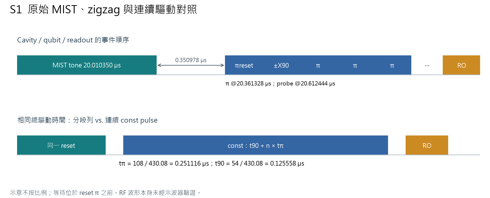
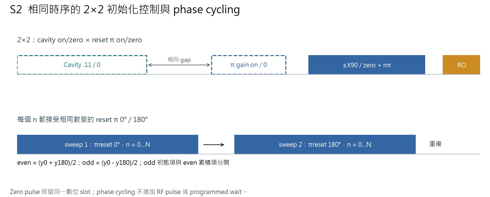
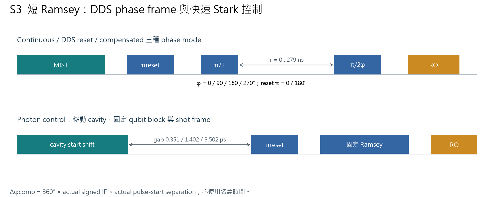
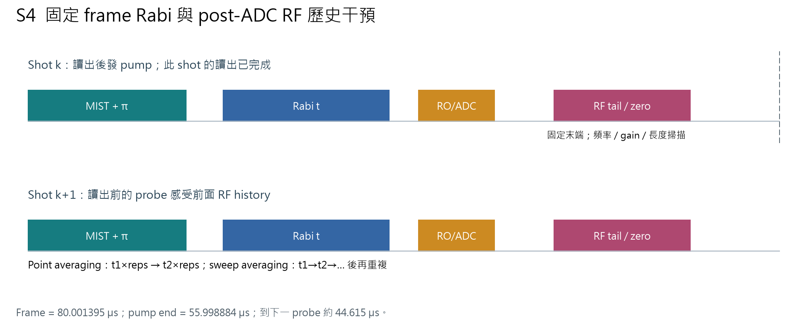
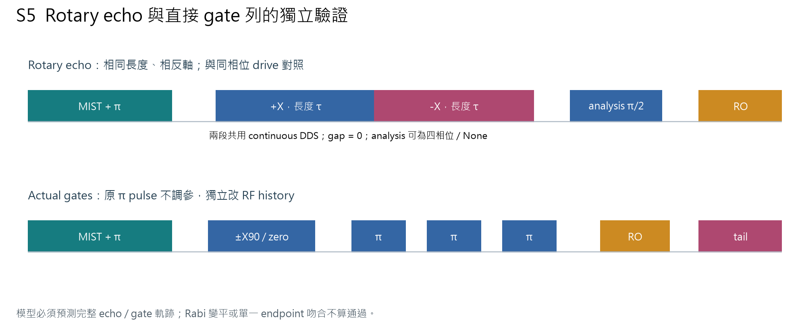
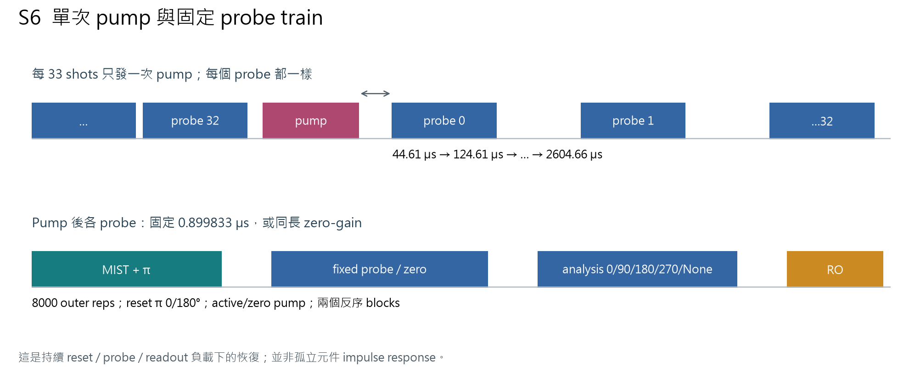
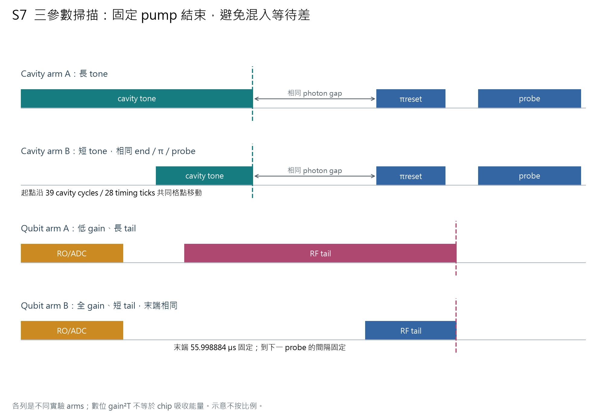
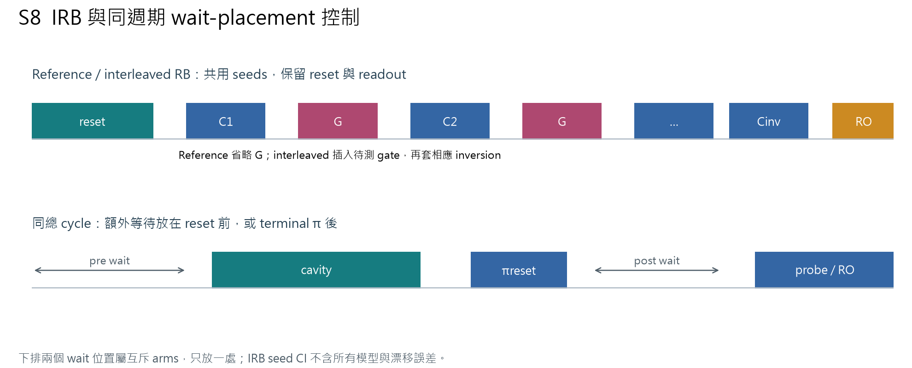

# Q1 half：四輪調查整合與波序列

條件：Q12_2D[10]/Q1 half flux、2026-10-06至10-07。本案例整合已有三個後續案例與最初排查，不新增硬體資料。1,875份不同正式HDF5重新SHA256核對通過；不把兩份native review copy當新測量。

完整交付見 [25頁調查報告](Q1_MIST_Zigzag_Investigation.pdf)。重現程序、候選矩陣、失敗方案、統計／模型限制、政策偏差及程式清理均在報告中。可移轉方法集中在 [調查流程](../../investigation-playbook.md)，具体數值留在以下既有案例：

- [初態、量化與phase cycling](../q1-half-20261007/README.md)
- [獨立native機制排查](../q1-half-mechanism-20261007/README.md)
- [Pumping三參數與actual-gate驗證](../q1-half-pump-dependence-20261007/README.md)

核心結論：terminal π相位相關初態偏差可等權phase cycling處理；主累積在zero-MIST也存在，RF history三參數依賴已在actual gates重現。沒有直接RF取樣，不能指定唯一元件或成因占比；沒有已驗收的完整修復。

## 波序列示意與證據範圍

所有圖依保存的cfg與編譯事件整理；不按時間比例，也不是示波器實測。顏色：青為cavity/reset區塊、藍為qubit控制、橙為readout、紫為conditioning。圖中的空白不代表正式gate額外idle；實際gap以cfg/ASM為準。

S1：photon wait在terminal π之前；相同總時長continuous drive可檢查pulse接縫是否必要。

S2：零gain保持slot；每個n接受等量相反reset phases。對比、odd初態與even累積不可混為一個loss。

S3：DDS reset與mixer NCO不同；以actual signed IF補phase。Short-long差未反序重現，只限制所測Stark窗口。

S4：當前讀出完成後的tail改下一shot；固定frame不等於固定RF history。

S5：使用獨立sequence驗證模型，不能以Rabi較平或echo尾端吻合當完整驗收。

S6：固定probe解除duration-sweep混淆；analysis gate也有history dependence，曲線不是元件impulse response。

S7：不同rows是替代arms；equal gain²T不保證相同recency或chip能量。

S8：同seeds／新seeds的獨立驗收；pre/post wait是互斥arms。CI不含全部漂移與模型系統誤差。

## 保存與清理

原repo：`C:/Users/QEL/Desktop/MeasureScriptX/QuantumMeasurementProcedures/Members/Codex-agent/Qubit-measure`。
調查根目錄：`.agent_state/measurement-tasks/20261007-q1-mist-debug/`；完整新交付位於`final_investigation/`。

其中`measurement_source_before_cleanup.zip`為base `46a4291cfdf1b1617bc1fb03499813450b16ed7e`的45檔overlay，SHA256 `9cf2374b4c6063acfa319a9e609ebcc8eeb0bad8ed67fe9b2f0a2036092af780`；不是完整repo或板端firmware。重演臨時native實驗需隔離checkout與fresh硬體授權／限制核對，不直接覆盖live工作目錄。

五個diagnostic leaf、catalog、unrolled/lead與臨時DDS-reset試驗能力已封存並移出正式runtime；保留cos/axis/frequency通用修正及reset_phase_cycle與10項regression cases。清理後888 tests、targeted Pyright/Ruff、16 contracts通過。程式清理不代表已重啟live GUI；本輪無新硬體操作。
