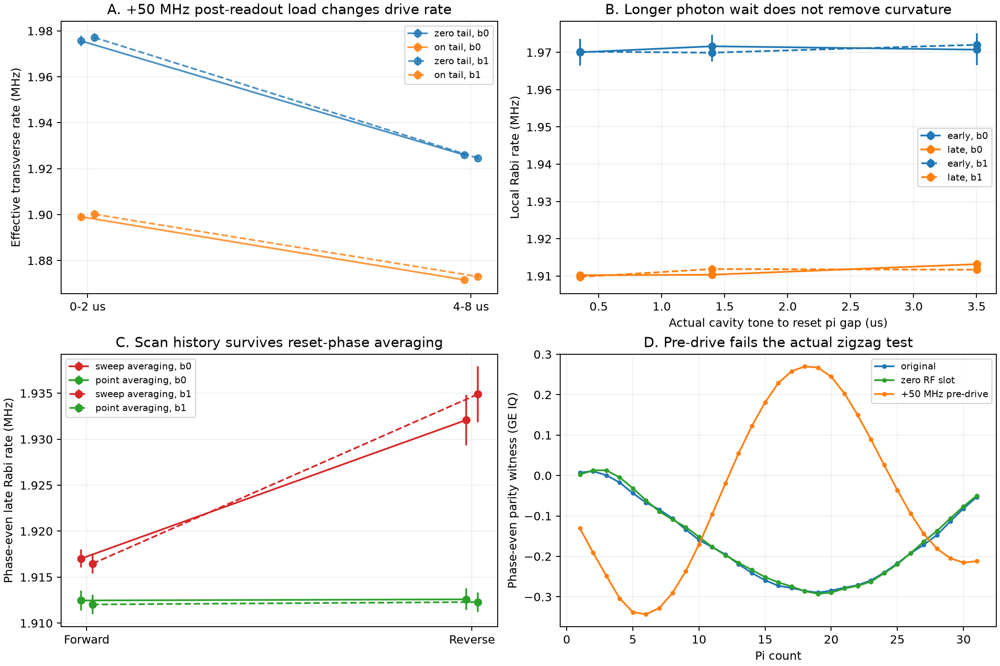
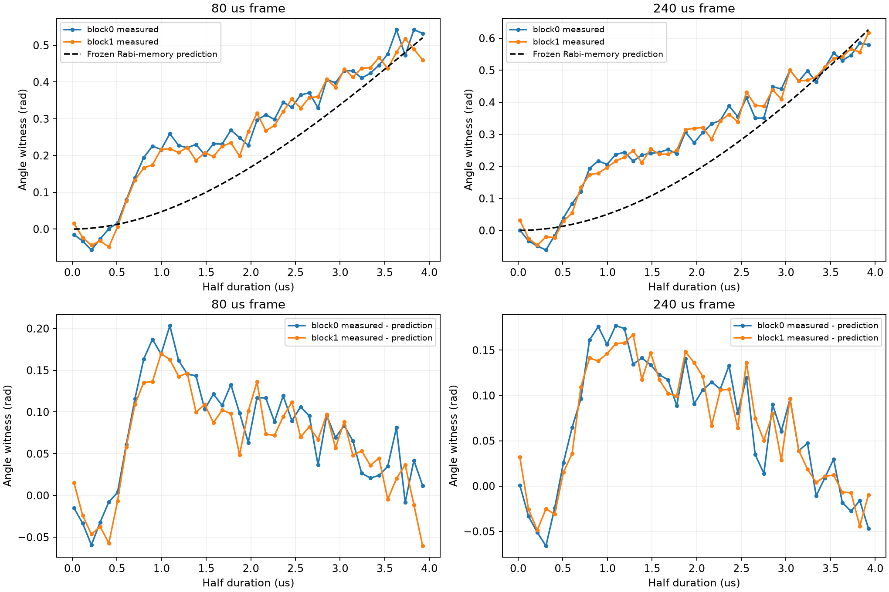
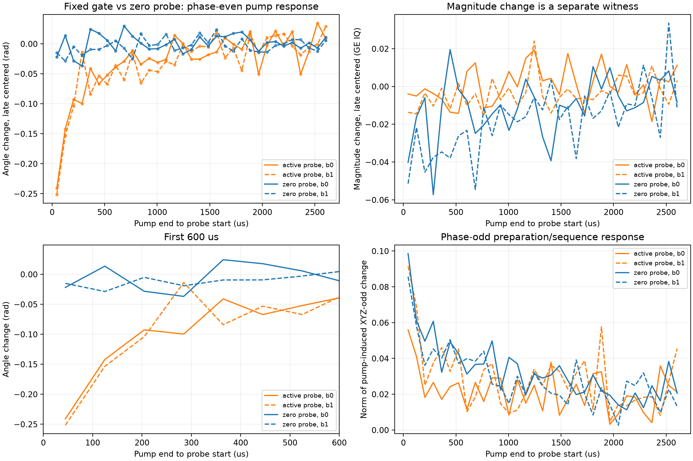
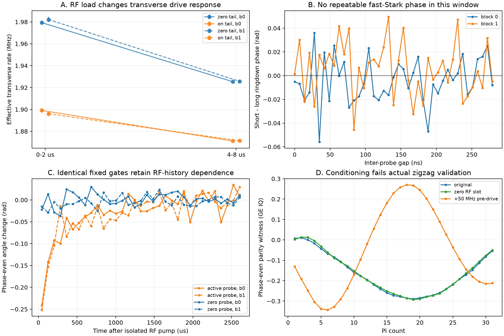

# Q1 half：版本調查、RF歷史干預與模型反例

2026-10-07新的4小時機制排查。Q12_2D[10]/Q1、+7.1804mA，沿用309.15320594MHz qubit drive、MIST5345.80198085MHz/gain.11/20.01us、terminal250nsπ與readout gain.02。用途是分辨reset後zigzag成因；數值非其他設備模板。先研究ZCU216/QICK並登記5候選，再以新增的獨立native experiments量測，未擴充舊實驗或writeback校準。

## 新證據與限制

Live board為ZCU216，firmware timestamp2024-09-10，QICK board.394/PC.418；tProc core200MHz、timing430.08MHz，qubit ch14 int4 generator、DDS1720.32MHz/mixer317.5。版本固定的RTL和Python顯示const繞過PL envelope FIR；RFDC後級插值仍存在。DDS reset不補償時，硬體fringe8.34–8.36MHz符合actual IF8.346794MHz；補償actual start separation後主fringe消失。原continuous DDS下zigzag仍異常，故這是可驗證的frame正控制，不是原主因。

Native QICK const Rabi與逐pulse zigzag均再現主要異常；原IR/Repeat lowering不是必要條件。Actual resetπ→probe為整數0gap，qubit DDS LSB.400543Hz，probe RF最大rounding error.182276Hz。這些只能核對software schedule，尚無RF直接取樣。

固定48us frame，resetπ0/180平均後，full-sweep正反方向late Rabi差15.07/18.42kHz，point averaging只有.12/.26kHz。Fixed frame沒有固定RF歷史，初態phase-odd項也不是方向效應的充分解釋。

固定80us frame，post-ADC16us/+50MHz RF tail相對zero gain使effective Ω早段約降77kHz、晚段降52–54kHz，chevron中心不相應位移。±tail gain仍保留主要effect；sameRF改mixer且tail IF翻號也保留。固定240us、固定RF能量只把tail距下一probe40→160us，晚段effect從−41..49降到−23..28kHz。支持RF歷史相關的有效橫向drive response，但不唯一指向放大器、RFDC或chip微觀機制。

圖源task `evidence_summary.png`。A為chevron Ω formal SE；B/C為局部Rabi fit formal SE，均不含model/drift全誤差。D為GE IQ parity witness。Pre+50MHz使主要parity更差，是conditioning失敗反例。

Actual tone→π gap0.351/1.402/3.502us下早晚約60kHz差仍在。0–279ns四phase Ramsey short−long平均phase差−.0043/+.0054rad；slope+5.8±5.7/−5.2±6.8kHz（兩反序blocksformal SE），沒有可重現fast Stark主項。Long gap visibility反而較低；不把延長ringdown當無代價修復。未排除全部非線性MIST／其他mode。

## 不接受僅endpoint吻合的模型

Rabi-only intrashot droop預測rotary echo長端.883rad，實測約.437。加入跨shot on/off memory並只用22point-Rabi traces fit後，effective τon12.86us/τoff64.84us；先凍結model，再量新80/240us echo。尾端近似吻合，完整曲線仍有.088–.100rad RMS、early約.2rad系統殘差，而且低估scan方向差。因此不做predistortion、不稱其為硬體component time constants。

來源`echo_prospective_validation.png`及JSON，model hash與freeze時間在task。這是真正新增資料的holdout，沒有重fit到通過。

Pre+50MHz conditioning、post-ADC tail及complement total RF duration都未通過native zigzag驗收。初態coherence可以與主even累積分开；前輪phase cycling是部分處理，不是完整主項修復。主項仍需要直接RF取樣以區分控制鏈與chip。不要把同一GE witness的odd/even振幅比說成各物理原因責任百分比。

## 單pump固定探針

每17個固定0.9us probe shots後發一次16us pump，shot frame80us，probe時間44.61..1324.63us；兩terminal reset phases和四analysis phases/None。+50MHz pump後首點相對zero及晚端中心的phase-even角差−.276/−.247rad，反序重複保留；沒有掃probe duration。單exponential描述τ484/170us不穩定。這支持固定gate的history response，仍是含analysis pulse的序列witness，非RF波形。

33shot/8000reps將窗口延至2604.66us，active probe首點角差−.24108/−.25169rad，zero probe−.02194/−.01513rad。描述性exp恢復τ244/218us，屬此reset/probe train的effective response，不能指定為component時間常數。

來源task`impulse_controls.png`與summary JSON。角差與magnitude差均相對同probe條件之zero-pump及晚端5點中心；late scatter是point散布，非可靠母體CI。Zero probe改了RF負載，因此不是exact-history initial-state tomography，不將幅度比轉成原因占比。

Zero-probe magnitude下降約.040/.051，進一步post-hoc分解顯示analysis gate也在變：在affine兩能級GE readout下，用no-analysis的Z與四相位平均的`Z cos(alpha)`推得analysis π/2角下降.0396/.0447rad。直接no-analysis GE投影首點變化只有+.0051/+.0088，晚端scatter.0041/.0094。因此magnitude下降不能全當初態變混；GE中心drift、leakage、四軸誤差及不同arm的history仍是限制。此推導是模型依賴witness，不是完整tomography。

## 原始來源

Repo `C:/Users/QEL/Desktop/MeasureScriptX/QuantumMeasurementProcedures/Members/Codex-agent/Qubit-measure`。

Primary sources：[QICK .418 Python](https://github.com/openquantumhardware/qick/blob/ba47c4425e105558b8c40afb615398485d264ac4/qick_lib/qick/asm_v2.py)、[int4 output mux](https://github.com/openquantumhardware/qick/blob/b07359b3cfb94a969fcc8eb551c1a3214c98e503/firmware/ip/axis_sg_int4_v2/src/signal_gen.v)、[int4 phase counter](https://github.com/openquantumhardware/qick/blob/b07359b3cfb94a969fcc8eb551c1a3214c98e503/firmware/ip/axis_sg_int4_v2/src/ctrl.sv)、[AMD RFDC update events](https://docs.amd.com/r/en-US/pg269-rf-data-converter/Dynamic-Update-Events)。RTL日期接近build但不是板上bitstream精確commit證明；actual配置依live snapshot。
任務`.agent_state/measurement-tasks/20261007-q1-mist-debug/mechanism_4h/REPORT.md`；`INDEX.md`、`RESEARCH.md`及各`*_PLAN.md`保留候選／來源與採集前分叉。Raw在`Database/Q12_2D[10]/Q1/2026/10/Data_1007/Q1_H5_*.hdf5`，每個receipt保存cfg/正式path/source_manifest，audit有raw SHA256與actual axis/RF/ASM。初期未有immutable source snapshot的限制保留。

五個獨立leaf位於`zcu_lab/v2/diagnostics`，targeted tests/type/lint/import checks詳見task的`DEVELOPMENT_VALIDATION.md`。沒有用新diagnostics的程式內容代替量測證據。

採集偏差：早期196條Rabi/echo的8-cycle起點為18.6ns，低於父task記錄30ns下限；agent已披露，新增actual-channel duration guard並改未來default。排除最短點後early chevron Ω改變<.25kHz，約77kHz差仍在，echo full-curve holdout仍失敗；此分析不能撤銷已發pulse或其prior history。固定0.9us pump probes、π/2 Ramsey及native zigzag本來在限制內。方法教訓是task policy與QICK的最小可編譯waveform不同，native新實驗也必須套用任務限制。

最後以13cycles=30.2269ns起點重新在硬體量20條、兩反序blocks。Effective Ω的active−zero差為early−80.22/−86.14kHz、late−54.18/−54.27kHz，center差<2kHz且小於formal不確定度。Free-curvature模型仍保留early−78.76/−81.24、late−53.87/−52.07kHz；fixed-curvature redχ²最高3.25，模型非完美。這是新合規資料的重現，不以刪除原點替代。

此圖四panel均使用符合30ns限制的pulse；來源task`final_evidence.png`，A為`disp13_dispersion_analysis.json`。較早evidence-summary的scan-order/gap含最短點偏差，保留原始provenance，不改寫history。

收尾441筆raw/cfg/actual-axis audit全部通過，MD/ML前後逐項相同，GUI無tabs/running/executions。五個leaf及21targeted tests/type/lint/16import contracts通過；更廣選集226passed/3個既有phase_reset role-golden failures。原始RF鏈或chip微觀機制仍未唯一定位，主要zigzag沒有被宣稱已修復。
