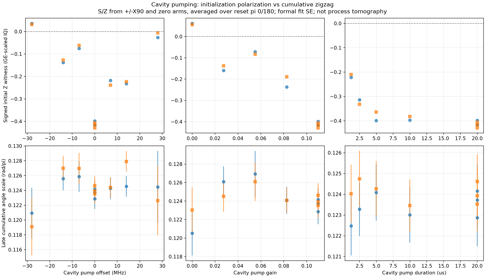
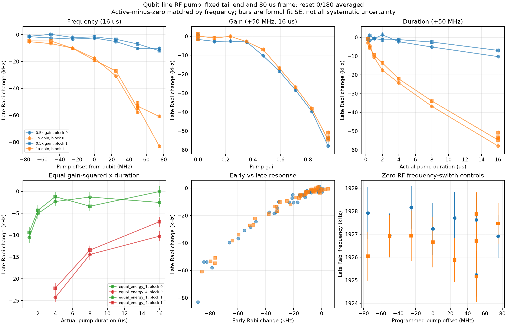
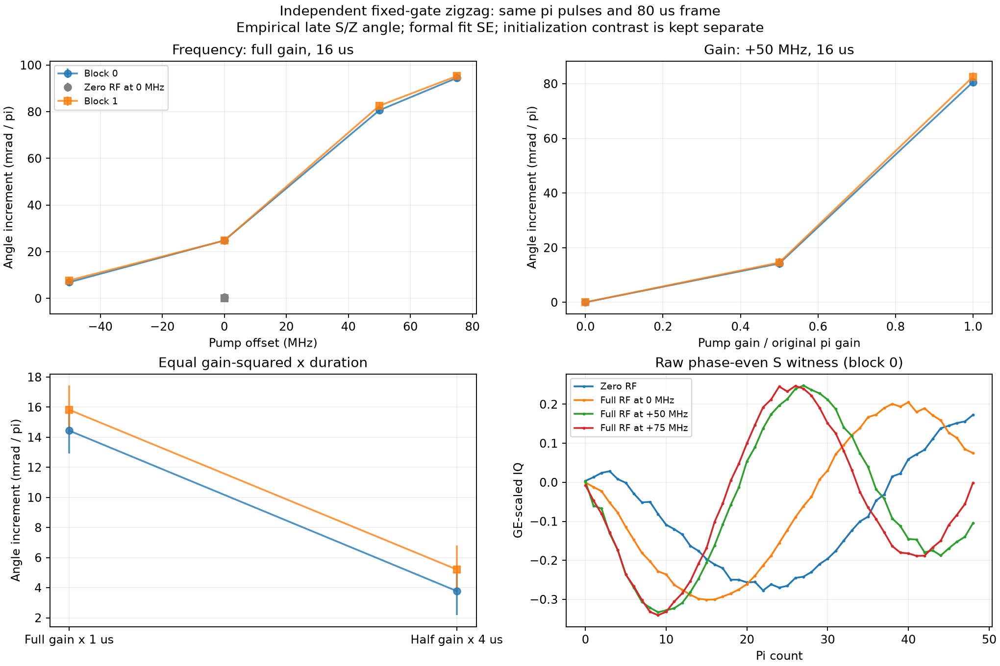

# Q1 half：pumping 三參數、等劑量反例與 actual-gate 驗證

2026-10-07新增4h。Q12_2D[10]/Q1，+7.1804mA；沿用309.153205939MHz drive、MIST5345.801980847MHz/gain.11、原250/125ns gates與readout gain.02。數值只供此案例追溯，不能直接移作其他設備設定。未改gate/calibration或量測production source。

## 固定時序下分開兩種RF

Cavity測16條件，頻率offset±28/±14/±7/0MHz、gain0/.0275/.055/.0825/.11、長度1.260..20.010µs。使用39個cavity fabric cycles／28個tProc timing ticks的共同格點，固定tone end20.010349893µs、π start20.361328125µs、probe20.612444196µs及60µs nominal frame。72 Rabi與216 zigzag traces、兩reset phases與兩blocks。

Cavity三參數明顯改初始化IQ。Gain.0275的visibility約.134，.055反而約.068，.11約.313；不能把gain降低後raw parity變小當gate修好。主要phase-even累積尺度仍約.12rad/pi。近似等g²T的.055×20us/.0778×10us/.11×5us，visibility約.068/.097/.297。GE projection相對complex IQ主軸RMS最大損失.319%，不足解釋數倍訊號差；仍不是已校正population／leakage。

圖源task的cavity_zigzag_dependence.png。上排initial Z witness，下排empirical late S/Z angle；bar為formal fit SE，低contrast不能作精確null。

Qubit RF放在ADC後，固定末端55.998883929µs及80µs nominal frame，影響下一shot。228 traces、53條件、173points×1500reps、point averaging、兩個條件／length順序反轉blocks。RF offsets−75..+75MHz，gain0..0.94685，actual length.2511..15.9993µs；各頻率同頻率zero gain對照。

來源qubit_parameter_dependence.png。局部late Rabi active−zero不是qubit本徵frequency shift。Full16us下−50/0/+50MHz約−5..7/−17..19/−53..55kHz；+75MHz早期−83、之後約−61kHz。固定digital gain未校正analog RF transfer，不能將frequency curve當chip吸收譜。Low gain幾kHz差與重複散布同量級，不宣稱threshold。

## 等劑量不是充分描述

Full4us與half16us的actual g²T近同，late response相差14.05/15.21kHz，兩block重現；共同zero reference抵消。固定末端代表不同RF年齡分布，故此結果否定total dose alone，並不單獨證明非線性power susceptibility。

描述式A*g^p*(1−exp(−T/tau))：late p2.595/tau9.572us，early p2.059/tau4.917us。Training RMS由energy-only的late4.03降至1.81kHz，但小reserved set兩模型都約1.4kHz；不可用它選唯一機制。窗口依賴、drift與residual不允許把tau指定為放大器常數。第一block凍結frequency-factor預測，第二block14個新條件RMS1.51kHz，僅是有限範圍近似。

## 依新觀察追加ABBA

因+75MHz差約22kHz，新增24traces F/R/R/F。Zero、+50、+75MHz的late F−R=+.07/−.16/−1.45kHz，formal SE約1kHz；+75新F/R全落1.8640–1.8665MHz。Old/new forward cfg逐項相同，兩reset phases各自保留早期偏差。因此未把原差歸因scan方向；保留時段／未觀測history狀態差，沒有刪掉早期1.843MHz點。

## 原pulse的獨立gate驗證

108 traces、9條件、兩blocks、n0..48、兩reset phases×initial +X90/−X90/zero。原gate gain/length/frequency未調參。S取相反X90之差，Z另含zero arm；zero arm改RF負載，故不是完整process tomography。

來源gate_parameter_dependence.png。同carrier的RF on−off增加.02428/.02470rad/pi；zero RF只改freq register 0↔+50MHz為.00053/.00008rad/pi（formal SE~.0017）。+50/full16us增量.08061/.08255，half16us為.01418/.01453。等劑量full1us與half4us仍差.01066/.01062rad/pi（formal SE~.0014）。支持RF歷史改變actual gates，不只是Rabi fit或initial contrast。

qzz前凍結Δtheta=−2π*(108/430.08us)*Δlate_Rabi，無額外可調係數。多數條件量級吻合，但full+50約6mrad/pi residual，早期+75較大Rabi預測超過後來gate約37mrad/pi。保留失敗和時段限制，沒有重fit到通過，沒有宣稱IRB修復。

## Provenance與限制

Qubit zero/full+50MHz的assembly逐字相同，waveform gain不同；actual DDS rounding最大.1823Hz。Cavity／qubit frame分別25805／34407 timing ticks，integer gate gaps核對為0。這些不證明真正DAC輸出包絡；仍需直接RF量測區分控制鏈與chip。沒有原因百分比、唯一壞元件或已驗證predistortion。

Task：`.agent_state/measurement-tasks/20261007-q1-mist-debug/pump_dependence_4h/REPORT.md`，repo `C:/Users/QEL/Desktop/MeasureScriptX/QuantumMeasurementProcedures/Members/Codex-agent/Qubit-measure`。Raw：`Database/Q12_2D[10]/Q1/2026/10/Data_1007/Q1_P3_*.hdf5`；每trace intent/receipt留cfg、實際path、source hash及operation。MODEL_PLAN、DIRECTION_PLAN、兩個frozen prediction JSON保留時間與holdout來源；audit_summary/final_verification記錄收尾。另有20條dense cavity抽驗，取樣敏感性以REPORT及dense_cavity_comparison為準。

最後20條dense cavity保留對比排序：base~.308、l5~.294、energy_mid~.099、g0~.066、g.055~.060。高對比late與coarse差約−.7..−3.9kHz；低對比formal SE較大。因非同時採集，不能將差異全歸因取樣，也不聲稱精確無差。

本輪668筆raw／cfg／actual-axis核對完成，17個量測source hash未變；所有task tabs保存後關閉，GUI idle，context與裝置狀態前後一致，無校準寫回。
