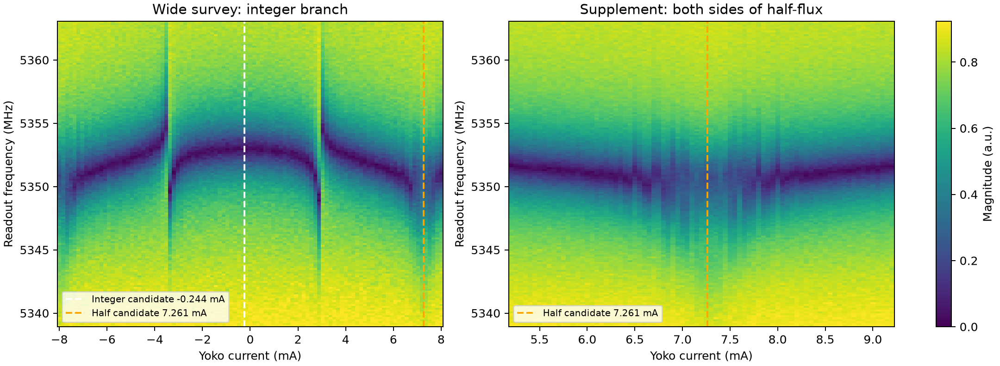
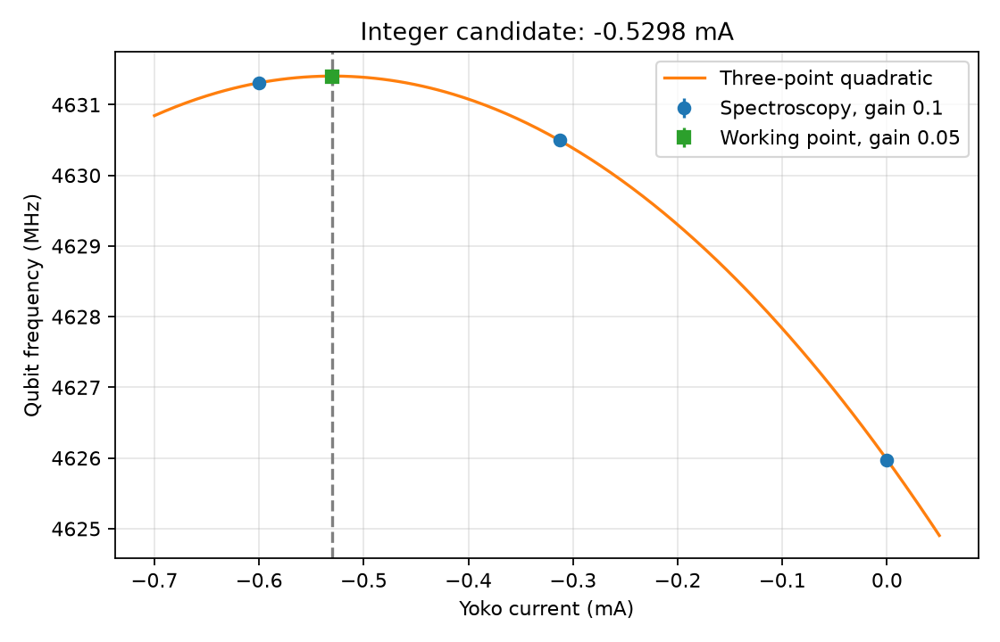
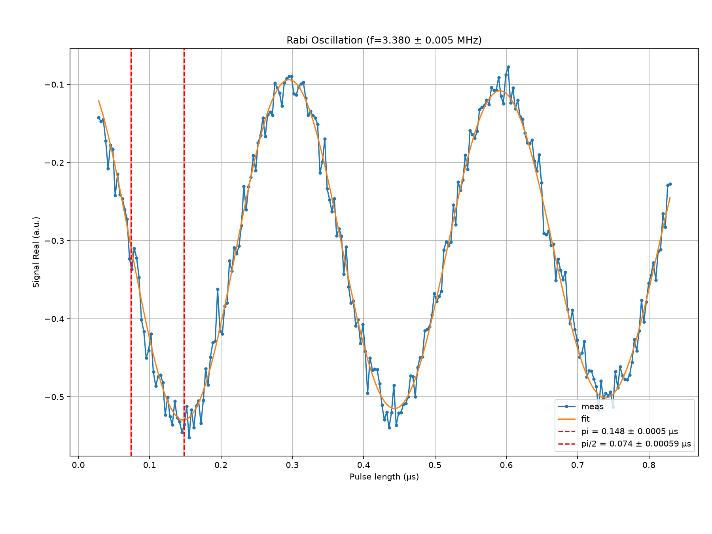
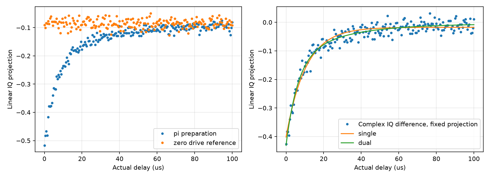

# 真實案例：Q1 integer 候選工作點與 coherence

## 適用問題與證據層級

2026-10-05，Qubit-measure workspace，以 measure-gui 操作真實 ZCU216 和 Yoko，project `Q12_2D[10]/Q1/R1`、context `100513_integer_search`。一小時 coherence 預算內，從 resonator flux map、局部 spectroscopy、Rabi 走到 T1／T2r／T2e，最後保存限制並停止量測。

本案例保存可移轉的判斷方法，不是可直接執行的儀器設定。Yoko ±10 mA、drive ch2/NQZ2、gain 上限及 pulse 時長限制來自當次使用者確認。舊 cooldown 設定只作搜尋種子；數位 gain 不是樣品端功率。沒有驗證所有讀出鏈線性、ADC clipping、磁滯、絕對 flux quantum 編號或 gate fidelity。

| 層級 | 本案例內容 |
| --- | --- |
| 實測 | Flux maps、頻率隨電流變化、Rabi、三種 coherence、zero-drive reference、actual timing |
| 使用者專家建議 | Map 盡量含 integer／half 各自對稱結構；pulse 建議 0.05–0.2 µs且當次下限 0.03 µs；echo 人工 detune；zigzag 檢查 pulse |
| 有條件的分析 | 三點二次極值、單／雙 exp T1、不同 envelope 的有效 T2 |
| 未驗證 | 慢尾端機制、GUI／離線 fit 差異成因、zigzag、單因素 pulse／wait 效果、相同最終設定的多次 repeat |

## 決策一：map 的覆蓋和 sweet spot 的角色分工

初次 ±1 mA 局部 map 曲率弱；−8 至 +8 mA 的全局 map 可辨認中央分支兩側結構，但約 +7.2 mA 的 half 候選靠近邊界。之後補 +5.2 至 +9.2 mA，而不是再次掃完整區間。全局和補掃同為 5339–5363 MHz、161 frequency points、readout gain 0.03；flux 點數與平均數不同，分析時保留差異。這個組合補足兩個候選各自兩側結構，未測反向掃描。

來源：`R1_flux` 第 2／3 份 raw；衍生圖由 `plot_flux_coverage.py` 產生。看中央分支與右側 half 的覆蓋，不把鏡像 marker 當成已驗證的 qubit sweet spot。鏡像候選 integer −0.244489 mA、half 7.261250 mA；period 15.011479 mA 是該鏡像估計的衍生值，未用後續 qubit 極值重新校準。

在 −0.313 mA 核對 readout：5353.061799 MHz、FWHM 8.0241 MHz。Lookback arrival 0.47578 µs，與歷史 0.48464 µs 接近，維持原 trigger offset 0.53464 µs。此觀察支持時序核對，不能代替 clipping 或最終 flux 下讀出最佳化測試；最後在 −0.530 mA 的 Rabi／coherence 有可辨認對比。

Two-tone 在 −0.313 mA，drive gain 0.5 粗掃得中心約 4630.35 MHz、FWHM 9.38 MHz；降 gain 0.1 窄掃得 4630.496 MHz、FWHM 1.43 MHz。峰可追蹤而 linewidth 明顯受條件影響，沒有把線寬轉成 intrinsic T2。

| 電流（mA） | Qubit frequency（MHz） | 單次 fit stderr（MHz） |
| ---: | ---: | ---: |
| −0.600 | 4631.30946 | 0.02846 |
| −0.313 | 4630.49576 | 0.02488 |
| 0.000 | 4625.97604 | 0.02247 |

三點二次極值 −0.529794 mA；僅傳播各頻率 fit error 的 Monte Carlo 標準差約 0.00460 mA。三點無法檢查二次模型失配，該數字不包含磁滯、漂移和其他系統差。移到 −0.530 mA、gain 0.05 再掃得 4631.40045±0.02140 MHz，與插值候選相近；仍不能宣稱精準且唯一的 sweet spot。

來源：spectroscopy raw 第 2／3／4／5 份及 `plot_sweetspot.py`。圖中候選點與三個建模點使用不同 gain；它驗證候選附近頻率，不構成完全相同條件的重複測量。

## 決策二：先選適合的 pulse 時長，再校準與檢查

| Rabi gain | 原生 π 候選（µs） | π/2 候選（µs） | 決策 |
| ---: | ---: | ---: | --- |
| 1.0 | 0.04335 | 0.02167 | 未採用；π/2 太短，且舊 cooldown 長度不可直接沿用 |
| 0.1 | 0.44277 | 0.22138 | 曾用於初輪 coherence；使用者提醒長 pulse 受 T2 影響後改調 gain |
| 0.3 | 0.14793 | 0.07396 | 新校準符合當次建議區間，重新量三種 coherence |

來源：Rabi 第 3 份 raw 的原生分析圖，gain 0.3、frequency 4631.441 MHz、recovery 100 µs，free phase + decay，R² 0.9863。看週期、首個激發極值及 pulse marker；不能以 R² 證明 gate fidelity。Frequency 已根據前兩輪 Ramsey 修正後重做 Rabi，因此 gain 比較也不是只變一個參數。

名義 sweep 0.030–1.230 µs、241 points，保存的量化軸為 0.0283787–0.8296608 µs。擬合與窗口判讀使用這份實驗軸，不用名義終點代替實際終點。當次 Run 成功；使用者事後澄清，0.03 µs 限制指不合法設定會在執行時顯式報錯，不是對量化座標施加另一個固定截斷值。先前把首點稱為硬體違規並要求起點改 0.035 µs 的推論已撤回。

曾排除首點做離線敏感性分析，half-period 約 0.148464 µs、含 phase 的首個激發極值約 0.146518 µs；原始資料保留。這不證明首點無效，也不要求今後自動剔除。可遷移教訓是分清設定合法性、實驗已量化的座標、模型窗口與 pulse fidelity 四個問題。

使用者建議 zigzag 作獨立 pulse 檢查；當次公開 adapter 清單沒有入口，也沒有足夠的公開 sequence 定義，未執行。沒有猜測 zigzag 的脈衝序列，也沒有旁路 MCP 控制硬體。應在後續有入口和預算時補做，不能將目前 pulse 稱為已通過 zigzag。

## 決策三：T1 慢尾端先辨別，不只追求較好 fit

| 條件 | 單 exp 有效 T1（µs） | 其他證據 |
| --- | ---: | --- |
| 長 pulse，wait 100 µs，window 100 µs | 10.917±0.253 | 同 raw 截 40／60／100 µs 得 8.67／9.68／10.92 µs |
| 長 pulse，wait 200 µs，window 150 µs | 11.432±0.281 | 雙 exp 約 5.73±0.35、33.1±3.4 µs |
| 短 pulse，wait 100 µs，window 100 µs | 10.317±0.258 | 慢尾端仍存在 |
| 短 pulse 減 zero-drive reference | 10.442±0.375 | 雙 exp 約 6.18±1.05、26.45±9.41 µs |

這些是條件比較，沒有把 wait、window、pulse、frequency 的影響完全分開。可說在測過的條件下仍有慢尾端，不能說已排除 reset、thermal population 或讀出非線性。

Zero-drive reference 與短 pulse T1 保持完全相同 actual delay 軸、pulse 時長、flux、readout 和 wait；只把 drive gain 改零，rounds 從 10 降為 5。對照不是已知純 ground state，較少 averages 也增加差分噪音。採 signal 的固定 PCA 線性投影，同時作用在複數 IQ 的 signal／reference／差分；未各自旋轉後相減。

來源：T1 第 3 份及 background 第 1 份 raw，`check_background.py`。左圖 reference 首 10 點均值 −0.08231、末 40 點 −0.08357，散布約 0.01490；沒有與 signal 類似的明顯衰減。右圖差分仍有模型敏感性。此圖限制零 drive 時可見的背景，不能識別 signal 慢尾端機制；雙 exp 的兩分量也不是已證實的兩個物理通道。

因此保存有效 T1 和模型比較，沒有把雙 exp 第一個分量自動寫回單一 `t1`。

## 決策四：人工 fringe、模型與 repeat 要分開記錄

Echo 使用人工 detune_ratio 0.05；actual total-delay step 約 0.19996 µs，人工 fringe 約 0.25005 MHz。最後 Ramsey step 約 0.09998 µs、同 ratio 對應約 0.50009 MHz。Ratio 相同不代表 fringe frequency 相同。最後短 pulse 原生 fit 得 T2r 3.310±0.113 µs、T2e 6.360±0.263 µs；長 pulse 對照約 3.59／3.65 µs 和 6.69 µs，不能當相同最終設定的多次 repeat。

第一輪 raw 的獨立固定 PCA 投影分析：exp envelope 得 T2r 約 3.125 µs、T2e 約 5.739 µs；Gaussian envelope 得約 3.952／7.760 µs。GUI 原生 fit 約 3.59／6.69 µs。不同分析的觀測量／模型細節未完全對齊，差異原因沒有解決，也未查 implementation 猜答案。沒有用較小 stderr 或較漂亮曲線選擇「真值」，亦未以此識別噪音頻譜。

本案例支持保留原始 IQ、明寫模型、核對人工 phase 與 actual axis；不證明人工 detune 已消除背景。本輪未做 echo 互補 phase 差分，人工 detune 建議與 phase-cycling 驗證是不同事情。

## 保存、停止與可遷移範圍

量測在 13:39:35–14:38:26 Asia/Taipei 內完成採集／保存，截止 14:39:35。終態無 running operation，Yoko 留 −0.530 mA、output on；這是當次交接狀態，不是所有任務的關機策略。T1 tab 最後是 zero-drive control，library 正式 pulse 仍為 gain 0.3。報告結果對應指定 raw，不以最後 tab 畫面代替來源。

已寫回頻率、讀出與 pulse 候選；T1／T2 scalar 未寫回，保存分析與限制。普通數值留在此案例，方法整合回 [bring-up](../../README.md)、[flux](../../../flux-spectroscopy-validation/README.md)、[Rabi](../../../rabi-fit-validation/README.md)、[T1](../../../t1-fit-validation/README.md)、[coherence 背景](../../../coherence-background-validation/README.md) 和 [來源核對](../../../calibration-provenance/README.md)。

## 來源與重用

來源 workspace：`Qubit-measure`。原始 HDF5 留在該 workspace 的 `Database/Q12_2D[10]/Q1/2026/10/Data_1005/`；主要任務紀錄在 `.agent_state/measurement-tasks/20261005-q1-integer-coherence/`。跨主機時先核對來源可讀性，不能把這些 repo-relative 路徑當知識庫內的資料。

[來源 manifest](source-manifest.json) 記錄選用 raw、圖、結果及分析腳本的 workspace-relative 路徑與 SHA-256；精選圖已複製到本案例的 `figures/`，不依賴 MCP 暫存檔。[分析數值](evidence.json) 保存原生與離線結果的來源分組。原始量測檔未複製、未修改。

離線腳本仍留任務目錄，尚未整理為通用分析套件；manifest 是追溯入口，不是讓別的設備直接執行的 workflow。若要重跑，先閱讀腳本、核對 HDF5 軸／單位與模型，再用來源 workspace 的 `uv run --directory <repo> --no-sync -- python <script>`；腳本只讀 raw 並產生衍生檔，不能控制儀器。
