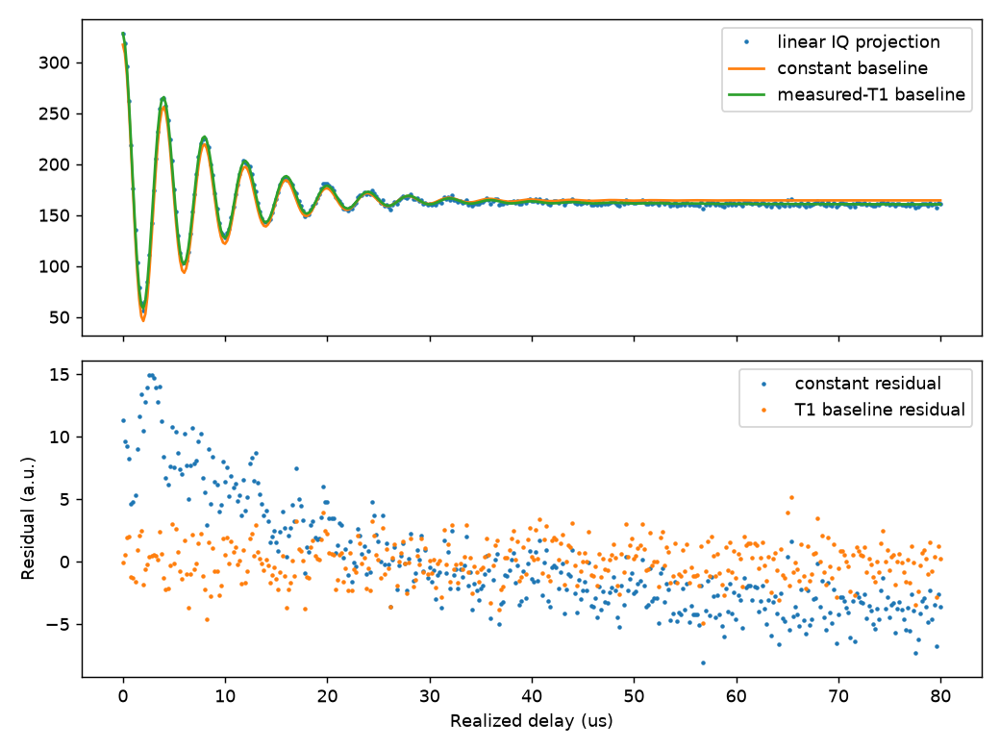
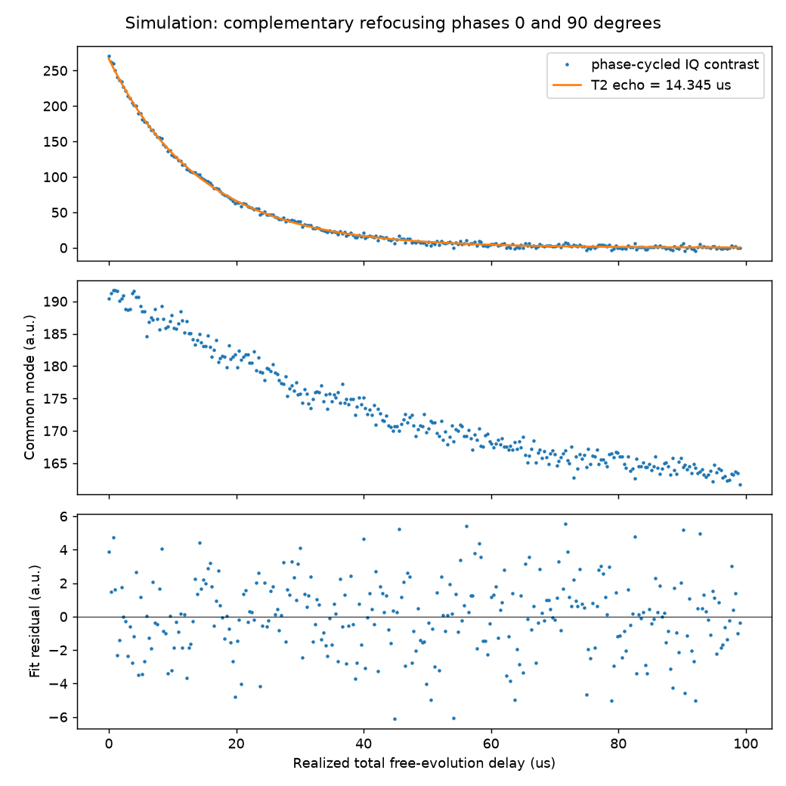

# Simulate 案例：從零定位 integer 候選並量測 coherence

## 證據範圍

2026-10-05 使用 Qubit-measure-gui 的 mock SoC 與 FakeDevice，從空白 project/context 開始。量測與最後 GUI 核對約 27 分鐘，使用者預算一小時。沒有操作真實硬體，也沒有讀取模擬器實作或以 predictor 真值作搜尋答案。

本案例提供流程反例及分析對照。這裡的 native 座標、gain、頻率、時間和 R² 全是案例條件，不是硬體預設值或通用驗收門檻。

## 搜尋與校準轉折

| 觀察 | 採取的判斷 |
| --- | --- |
| Lookback arrival 約 0.49479 µs，最後 trigger offset 約 0.54479 µs | 分別記錄到達時間與積分時序設定，不把兩者混用 |
| One-tone 寬掃找到約 6000 MHz 共振，再窄掃得到 6002.02227 MHz | 粗掃只選候選，窄掃才用於工作頻率 |
| Flux map 在 0 與 ±0.0025 native 附近有 extrema | 先標記分支候選，不由對稱性推論絕對 flux quantum 編號 |
| 首輪 two-tone 低 SNR 的自動 fit 選到雜訊 | 不接受。提高 readout gain、加密頻率網格並增加 averages 後辨認約 5423.42 MHz 譜線 |
| 窄掃含旁峰，全窗口 Lorentzian／sinc fit 不足 | 弱 drive 下對中央線局部 fit，只採中心估計，不把局部 linewidth 當成完整線寬 |
| 初始 Length Rabi 窗口沒有完整振盪，自動 π 候選不合理 | 先補足可辨認的振盪，再比較模型與第一個峰 |
| Amp Rabi 的 π gain 候選約 0.3256，與使用的 0.3 不一致，且有 residual | 保留為交叉檢查的疑點，沒有接受為最終 amplitude 校準 |

Two-tone 搜尋同時改了多個條件，不能把改善全歸因於 readout gain。Amp Rabi 也沒有證明最後 π pulse 的 fidelity。

初始 resonator map 給出 integer 候選 0.0025148515 native。局部 qubit spectroscopy 後採用下表中心：

| Native 座標 | Qubit frequency，MHz |
| ---: | ---: |
| 0.002449873573 | 5422.787849 |
| 0.002499873573 | 5423.391831 |
| 0.002549873573 | 5422.793583 |

這支持選定分支上的局部頻率極大值，不證明數學上精確 integer 或絕對編號。Context 的 flux period 仍為粗 map 的 0.0050693069 native，沒有用這三點重新估計完整週期。以上小數用於追溯設定，不是定位精度。

## Recovery wait 對 Rabi 的對照

初始 integer 候選、gain 0.3 的兩份 Length Rabi raw 使用相同實際軸，401 點，0.02865 至 7.32031 µs。事後用相同自由相位衰減 cosine、固定 0.75 rad 線性 IQ projection 重新分析，避免混入 GUI phase 選項不同的影響。

| Relax delay，µs | R² | Residual RMS，projection 單位 | Rabi frequency，MHz |
| ---: | ---: | ---: | ---: |
| 30.5 | 0.988703 | 7.9899 | 0.410090 |
| 150 | 0.999755 | 1.4515 | 0.411000 |

模型為 `c + a exp(-t/τ) cos(2π f t + φ)`，t 用 µs、f 用 MHz。重新分析的 f 範圍為 0.2 至 0.7 MHz，τ 為 0.1 至 1000 µs，φ 為 0 至 2π。數值與來源見 [same-model review](evidence/rabi-reset-same-model-review.json)。

每個等待時間只有一個 Run。結果支持 recovery-time effect，排除「只是換了 phase 選項」這個解釋，沒有唯一識別微觀機制。不能把改善稱為已測得高 gate fidelity，也不能由此規定所有 qubit 都等 150 µs。

最後在精修工作點重新校準，gain 0.3、π length 1.223552342 µs、π/2 length 0.615087912 µs。這些值只供追溯本案例。

## Coherence 的對照與限制

| 項目 | Run A，µs | Run B，µs | 分析 |
| --- | ---: | ---: | --- |
| T1 | 20.128 ± 0.041 | 20.022 ± 0.033 | 單指數，實際最長 delay 約 99.75／149.74 µs |
| T2 Ramsey | 7.964 ± 0.051 | 8.019 ± 0.051 | 線性 IQ，加入獨立 T1 的指數 baseline |
| T2 echo | 14.345 ± 0.065 | 14.353 ± 0.063 | 互補 refocusing phase 的複數 IQ 差分 |

這些最終 coherence Run 使用前述最終工作點與 const pulses。Readout frequency 為 6002.02227 MHz，gain 0.05，length 1 µs，integration length 0.9 µs。每點 reps 100、rounds 200；T1／Ramsey 的 relax delay 約 99.9331 µs，echo 為 150 µs。完整實際設定見 raw audit。

± 是各模型下的 fit stderr，不含共同系統誤差。T1 兩次相差約 0.105 µs，約兩倍合併 stderr，因此不能把單次 0.03 µs 當成總準確度。

Ramsey 的實際軸為 0 至 79.9851 µs、401 點，兩次人工 fringe 約 0.25／0.40 MHz。固定 baseline T1 為獨立長窗口結果 20.02248875 µs。同一線性 projection 下，Run A 的常數 baseline residual RMS 為 4.5991，加入指數 baseline 後為 1.5627。這個比較與 GUI 自身資料轉換下的 fit 不混用。

Ramsey 改 40／60／80 µs 窗口，T2r 變動小於 0.01 µs；固定 T1 改成 19.9／20.2 µs，T2r 變動小於 0.001 µs。這只支持本次候選模型在檢查範圍內穩定，不證明背景一定由 T1 造成。

Echo 的實際軸為 0 至 99.0513 µs、301 點。兩個 π/2 phase 固定 0°，中間 π phase 改 0°／90°。單條常數 baseline fit 約 10.8／17.6 µs，不能任選一條。先前把 relax delay 從約 100 改 150 µs，單條結果仍約 10.56 µs，沒有消除偏差。

兩條 IQ 的平均顯示非定常共模背景；差分後投影、fit 得到上表的有效 T2 echo。分析使用 phase90 minus phase0，沒有除以 2，因此差分幅度是半差定義的兩倍，不影響衰減時間。第二組反轉相位的取得順序。窗口檢查涵蓋約 14.24 至 14.46 µs，仍大於單次 stderr 所表達的範圍。

共模背景的微觀來源未確定。反轉順序的 repeat 沒有顯示明顯短期順序效應，但不能排除所有漂移或共同偏差。方法的適用前提見 [背景辨別](../../../coherence-background-validation/README.md)。

## 精選圖例

圖中使用最終工作點的 Ramsey Run A。看常數與 T1 baseline 模型的 residual，辨別低頻趨勢是否仍在。此圖支持在同一 raw 上比較背景模型，不能證明指數背景是唯一物理模型。

圖中使用最終工作點的 echo 0°／90° pair。看共模曲線及差分 fit 的 residual，不能只看 fit 線與資料重合。此圖支持本案例的背景分離，不保證其他 sequence 只改中間 π phase 就能消除背景。

## 來源與可攜性

本資料夾保存兩張教學圖及三份分析／條件紀錄的原樣副本：

- [Final offline results](evidence/final-offline-results.json)，含兩組 Ramsey、echo 的 fit、窗口與 T1 敏感性。
- [Final raw audit](evidence/final-raw-audit.json)，含最終八份 coherence raw 的實際 pulse 與軸。
- [Rabi same-model review](evidence/rabi-reset-same-model-review.json)。
- [SHA256SUMS](evidence/SHA256SUMS)，用於核對上述 JSON 與 PNG 副本。

原始任務在 Qubit-measure-gui repository 的 `.agent_state/measurement-tasks/sim-integer-coherence-20261005/`。搜尋／校準轉折來自該任務的 `journal.md` 與 `RESULTS.md`，分析來源為 `analyze_coherence.py` 及 `evidence/`。腳本含任務專用路徑，不是通用分析工具，這裡沒有把它發布為可直接套用的函式庫。

Raw 根目錄相對原量測 repository 為：

`Database/simulate_20261005/integer_flux_coherence/2026/10/Data_1005/`

檔名格式為 `integer_flux_coherence_<kind>_1005@integer_flux_from_zero_<n>.hdf5`。

| 用途 | kind | n |
| --- | --- | --- |
| Rabi 等待時間比較 | len_rabi | 3、4 |
| 最終 Rabi | len_rabi | 5 |
| 最終 T1 | t1 | 2、3 |
| 最終 Ramsey | t2ramsey | 2、3 |
| Echo A，0°／90° | t2echo | 6、7 |
| Echo B，0°／90°，取得順序為 90° 再 0° | t2echo | 9、8 |

本案例 HDF5 的 `Data/Data` 是 N×3×1，三欄由 `Data/Channel names` 標示為時間、IQ 實部、IQ 虛部。時間以秒保存，分析轉成 µs。`comment` attribute 的 JSON 保存 cfg。這只是這批檔案的 schema，讀其他資料前需重新確認。

JSON 中的絕對路徑是原主機的來源紀錄，不是跨主機有效的連結。Raw 未複製到知識庫。要重新 fit 需取得來源 raw 並核對 schema；只有本知識庫時，可審閱方法、摘要和圖，但不能宣稱已重現 raw 分析。
