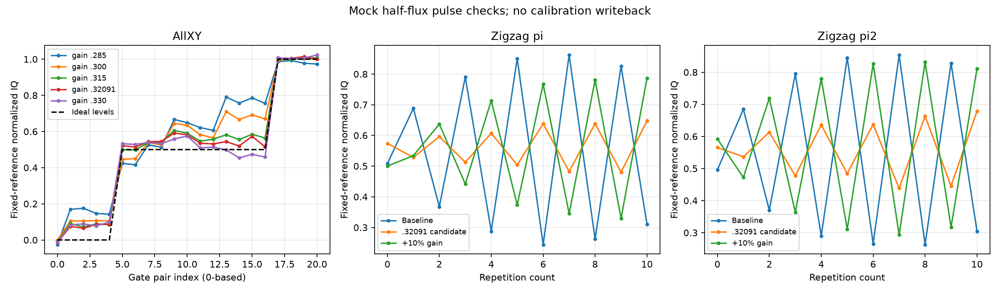

# Zigzag／AllXY mock 交叉檢查

## 條件與來源

2026-10-05，Qubit-measure-gui 的 mock SoC，half flux native=0，context coh30_p29。沿用前輪 Rabi 的 const pulse，frequency 581.84849 MHz，π length 1.256784 µs，π/2 length 0.631288 µs，gain 0.3。Readout 沿用該點的 readout_dpm。1D 實驗為 100 reps、1200 rounds、relax 150 µs。

原 task 為 `.agent_state/measurement-tasks/sim-zigzag-allxy-20261005/`。RESULTS.md 保留完整方法與 GUI 收尾，summary.json 記錄 14 份已保存 raw 的路徑、SHA-256、條件及比較指標。本目錄的 summary.json 與 comparison.png 是該 task 的副本。沒有讀 implementation 或模擬器真值。

## 直接觀察

Zigzag 的 π 與 π/2 都有交替偏離。AllXY 基準 gain=0.3 的 GUI power_err 為 15.082%，回到基準重測為 15.090%。兩個 pulse 同改 gain=0.285、0.315、0.33，power_err 分別為 23.619%、6.298%、1.727%。這說明新實驗能對 gain 變化產生可辨認的反應，不能由此斷言 Rabi 模型或真實 pulse 的誤差來源。

π Zigzag gain scan 得到候選 0.3209119。以可保存的一維 Zigzag 重測，並把同一 gain 用於 π/2，兩者偏離均縮小但仍不平坦。AllXY 在此 gain 的 power_err 為 3.439%，高於 gain=0.33 的值；gain=0.33 的 Zigzag 卻已反向偏離。兩個實驗沒有給出一致的最佳候選，未寫回校準。

圖的共同尺度由基準 AllXY 的 II 與最後四組 excited pair 建立，所有 Run 使用同一 signed IQ projection。Y 軸是 normalized signal，沒有獨立人口校正，不當成激發機率。Zigzag 候選 Run 同時更改 X90 preparation，並非只更改 repeated π 的單因子比較。完整 gain 條件見 summary.json。

## 可遷移判斷與限制

Rabi fit 與週期吻合，不能替代 sequence-level 交叉檢查。調整 gain 後應重測 Zigzag 和 AllXY，保留方向反轉及兩種指標不一致的結果。Preparation、relaxation、讀出正規化和模型差異都可能影響比較，本輪沒有辨別它們。

AllXY guide 把 power_err／detune_err 定義為模型的 mean state deviation，不是 gate infidelity。Gain=0.33 的同一 raw，fit_ge=false／true 得到 power_err 1.727%／3.746%，顯示分析假設也會改變數值。不同定義的指標不可直接換算或混稱誤差率。

這是 mock 案例。除了基準 AllXY 重測，各候選只有一個 Run，沒有可信的 gate-fidelity 結論，也沒有完成 π／π2 獨立校準。

## 工具限制

新增 experiment 後，MCP reconnect 只刷新 catalog，未讓舊 GUI 載入新 experiment。當次沒有公開 reload RPC，取得使用者授權後重啟才出現新 adapter。重啟初始化把 fake_flux 設成 0.5，量測前已恢復並核對 0。恢復 project／context 不等於恢復裝置值。

Zigzag gain scan 的 31 gain 點 × 7 repetition 配置可 Run、可分析，但 raw Save 失敗，錯誤為 `axis 'Times' length 7 != z dim 31`。圖像已保存，raw 留在 GUI tab；沒有 reset、重用或關閉該 tab。這是當次版本的操作證據，不推定為所有版本的限制。Scan 候選僅作定位，後續一維 Run 有保存 raw，才納入本案例比較。
