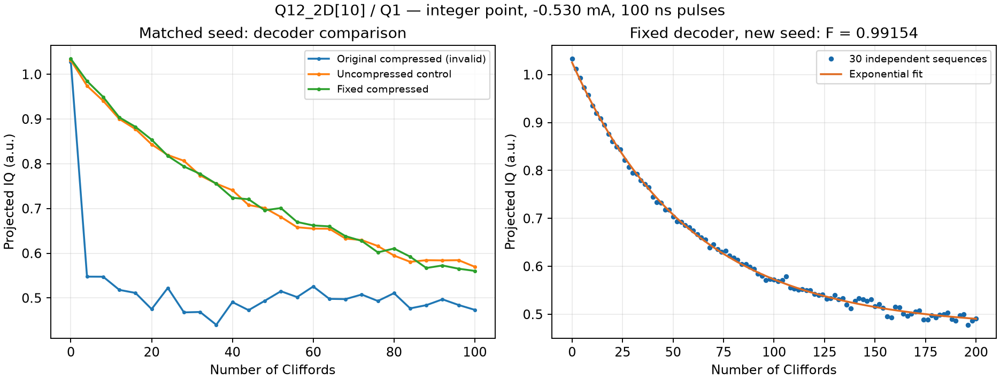

# RB 執行正確性與 fidelity 判讀

適用於單 qubit Clifford randomized benchmarking，特別是 AllXY／Rabi 正常，但 RB 在極淺 depth 就失去訊號，或最大序列長度改變後結果大幅不同。2026-10-06 Q12_2D[10]/Q1 真實 integer 案例提供下列辨別方法；數值不是跨裝置驗收門檻。

## 先驗證執行，再解讀擬合

保持 root seed、校準與共同 depth 相同，分別量短、長最大序列。如果共同的短 prefix 表現因最大 depth 而改變，先懷疑序列產生、查表、壓縮、編譯或時序路徑。不要直接把快速衰減歸因於 gate 品質；高 R² 也不能證明 RB 程式正確。

Rabi 驗證 pulse 旋轉角，AllXY 驗證基本 gate 組合；兩者正常仍不足以驗證動態長序列、壓縮查表與 recovery。保存 per-seed 資料，確認子種子確實不同且可重現。同一 root seed 的 `SeedSequence.spawn()` children 具有相同 `entropy`，不能只取 `child.entropy` 作為獨立序列的種子。

有程式路徑疑點時，用同設定停用該路徑作對照，再恢復修正後路徑測試。硬體操作仍使用量測 GUI；底層程式診斷屬 DEVELOPMENT，不以原始碼推論替代實測。

## 真實案例：壓縮 gate 查表

環境：Q12_2D[10]/Q1，2026-10-06，Yoko −0.530 mA，q_f 4631.453709 MHz，const π/π2 均100 ns，gain .443614164/.221807082；ZCU216，tProc v2 revision21。接線沿用10月5日。

| 對照 | 觀察與結論 |
| --- | --- |
| 原壓縮、maxdepth100 | 前幾個 depth 即崩落，表面 fidelity79.7%；無效 |
| 同種子、maxdepth10 | 共同短序列可回到基態，指向程式路徑 |
| 原壓縮、每gate加200 ns間隔 | 異常仍在，不支持單純指令吞吐不足 |
| 停用random gate壓縮 | 平滑衰減，Clifford fidelity99.004% |
| 修正解壓縮、恢復壓縮 | 同條件99.066%，與未壓縮對照相符 |
| 新種子、depth0:2:200 | 30獨立序列、300reps×2rounds，99.154%；bootstrap95%區間99.096–99.206% |

開發確認：tProc ALU 的 shift count 只讀低4 bits，16..31會wrap。舊解碼器以一次dynamic shift取32-bit word上半部，因而取錯gate。修正保留32-bit packing，將位移拆成≤15bit的兩段，1-bit值另補奇數bit。16種compiled lookup回歸案例在舊版全部失敗、新版全部通過；semantic mock simulation單獨不能驗證這項硬體限制。[QICK ALU 原始碼](https://github.com/openquantumhardware/qick/blob/main/firmware/ip/qick_processor/src/_qproc_ips.sv) 可作開發來源；更換FPGA時仍需核對實際版本。

圖左同root seed的壓縮前後對照，圖右新seed長序列驗證；y軸是投影IQ而非已校正存活機率。資料來源為 Qubit-measure repo `Database/Q12_2D[10]/Q1/2026/10/Data_1006/Q1_rb_1006@1006_rb_integer_{2,5,6,7}.hdf5`；詳細 task 記錄與離線bootstrap在 `.agent_state/measurement-tasks/20261006-q1-rb/`。分析圖是該raw資料的衍生輸出。

## 統計與適用邊界

Depth計Cliffords，F=(1+p)/2、EPC=(1-p)/2均是每Clifford，不能直接當單一physical gate fidelity。深度應涵蓋衰減和尾端基線，並換seed重驗。

同一序列的不同depth共享prefix，樣本有相關性。用整條序列做bootstrap保留此關係；單純fit covariance常低估跨序列不確定性。本案例native fit標準誤約0.010百分點，整序列bootstrap95%寬度約0.110百分點。這仍不涵蓋所有SPAM、漂移、leakage或RB模型系統誤差。

此案例證實該硬體、設定和長度範圍的修正有效，不代表任何pulse長度／program size都已驗證，也不是interleaved RB或leakage RB驗證。
